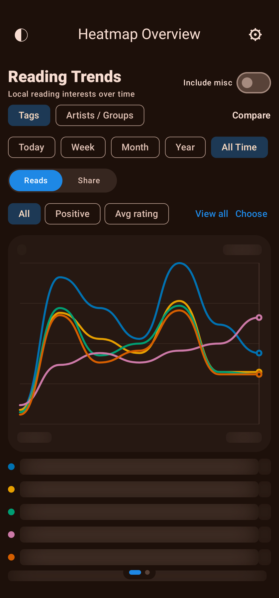
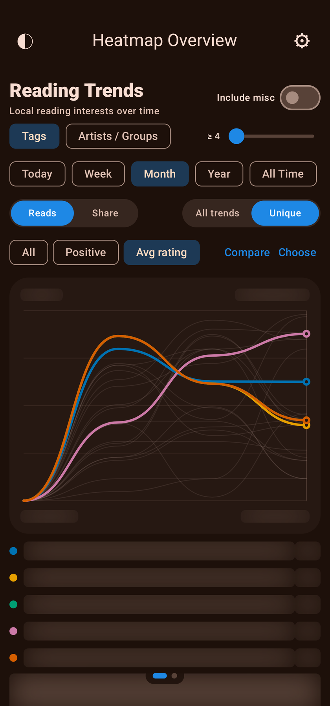
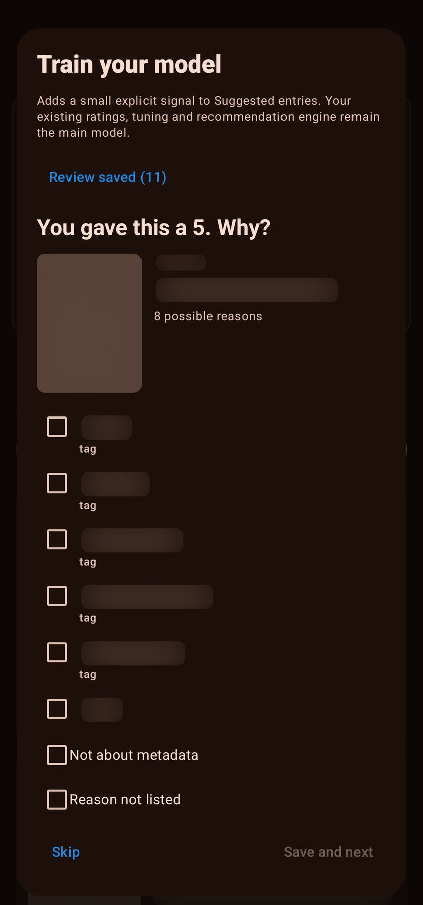
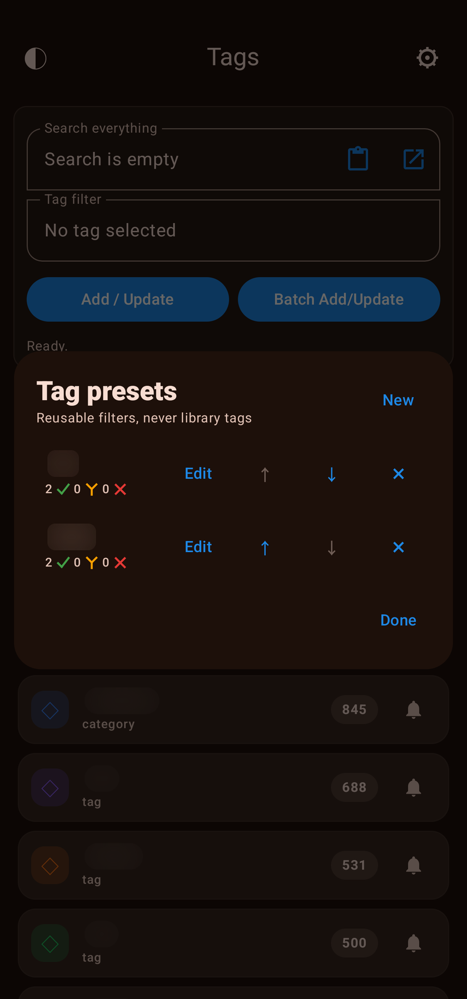
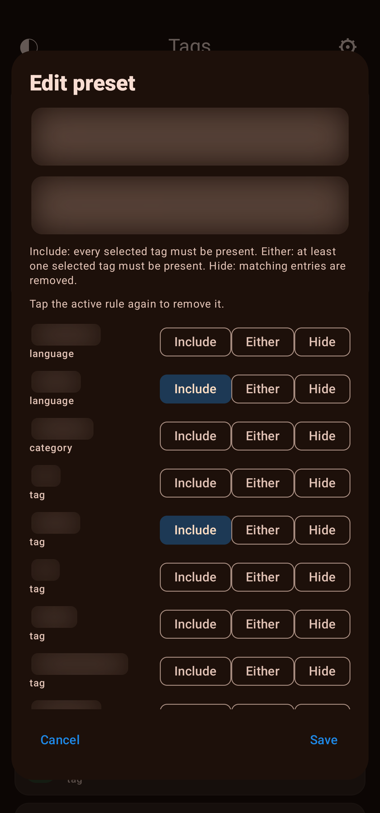
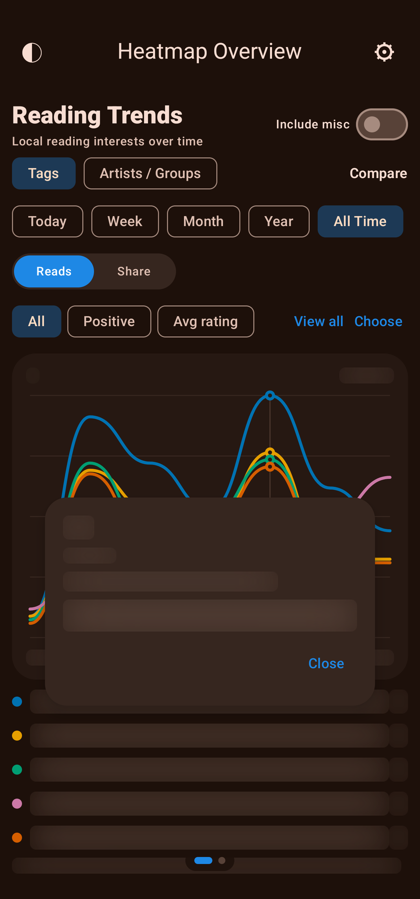
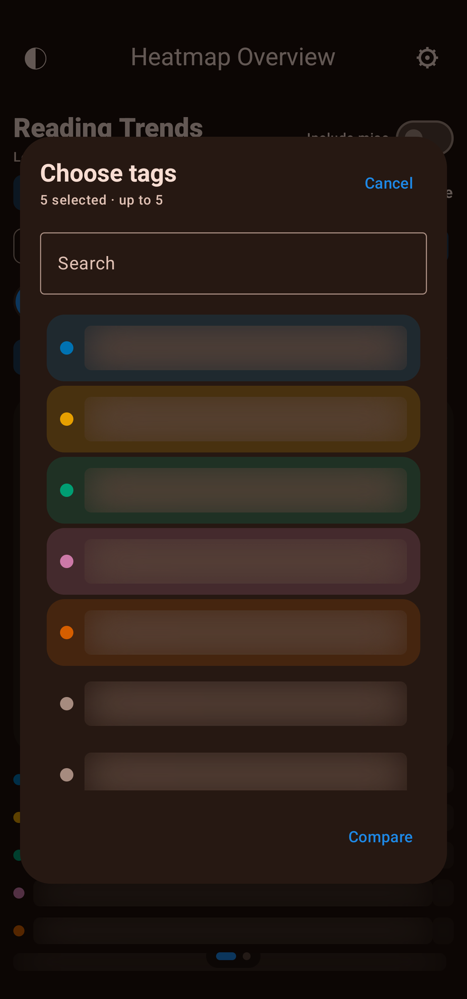

<h1 align="center">Sauce Tracker</h1>

<p align="center">
  A private, local-first Android library for organizing, exploring, and revisiting gallery metadata.
</p>

<p align="center">
  Library&nbsp;&nbsp;•&nbsp;&nbsp;Browser&nbsp;&nbsp;•&nbsp;&nbsp;History&nbsp;&nbsp;•&nbsp;&nbsp;Heatmaps&nbsp;&nbsp;•&nbsp;&nbsp;Backups
</p>

<p align="center">
  
  
  
  
</p>

<p align="center">
  
</p>

Sauce Tracker combines a searchable library, an integrated browser, reading history, recommendations, subscriptions, downloads, backups, and interactive tag and entry heatmaps in one on-device app.

> [!IMPORTANT]
> Sauce Tracker can display links and metadata for adult material. It is intended only for adults where such content is legal. The project is independent and is not affiliated with or endorsed by the website it accesses.

## Feature highlights

<table>
  <tr>
    <td width="36%">
      <h3>Your library, your way</h3>
      Search across codes, titles, metadata, dates, pages, tags, artists, and groups. Filter, sort, rate, pin, track read status, and move directly between related parts, even when the destination is hidden by the current filter.
    </td>
    <td align="center">
      
      
    </td>
  </tr>
  <tr>
    <td width="36%">
      <h3>Browse and import in context</h3>
      Open a library entry in the integrated browser, detect duplicates, update metadata, and return without losing the active browser task or the visible library state.
    </td>
    <td align="center">
      
      
    </td>
  </tr>
  <tr>
    <td width="36%">
      <h3>Revisit and discover</h3>
      Reading history, suggestions, subscriptions, artist pages, related entries, and heatmaps make a large library navigable without sending the collection to a cloud service.
    </td>
    <td align="center">
      
      
    </td>
  </tr>
  <tr>
    <td width="36%">
      <h3>Read in either direction</h3>
      Downloaded galleries can be read in horizontal or vertical slideshow modes, with separate privacy behavior for the library, browser, and reader surfaces.
    </td>
    <td align="center">
      
      
    </td>
  </tr>
</table>

<details>
  <summary><strong>View all screenshots</strong></summary>
  <br>
  <table>
    <tr>
      <th>Dashboard, dark</th>
      <th>Dashboard, light</th>
      <th>Dashboard, incognito</th>
    </tr>
    <tr>
      <td></td>
      <td></td>
      <td></td>
    </tr>
    <tr>
      <th>Selected entry</th>
      <th>Tags</th>
      <th>Suggested entries</th>
    </tr>
    <tr>
      <td></td>
      <td></td>
      <td></td>
    </tr>
    <tr>
      <th>Browser, dark</th>
      <th>Browser, light</th>
      <th>Reading history</th>
    </tr>
    <tr>
      <td></td>
      <td></td>
      <td></td>
    </tr>
    <tr>
      <th>Duplicate check</th>
      <th>Entry customization</th>
      <th>Display</th>
    </tr>
    <tr>
      <td></td>
      <td></td>
      <td></td>
    </tr>
    <tr>
      <th>Personalization</th>
      <th>Data</th>
      <th>Stats and security</th>
    </tr>
    <tr>
      <td></td>
      <td></td>
      <td></td>
    </tr>
    <tr>
      <th>Horizontal slideshow</th>
      <th>Vertical slideshow</th>
      <th>Direction picker</th>
    </tr>
    <tr>
      <td></td>
      <td></td>
      <td></td>
    </tr>
  </table>
</details>

> Screenshots were captured with Sauce Tracker's privacy masking enabled; private search terms, metadata, and thumbnails are obscured.

## What is new in 1.9

Version 1.9 adds deeper local trend analysis, explicit recommendation training, reusable composite filters, and library diagnostics while preserving the existing suggestion engine and local-first data model.

<table>
  <tr>
    <th>Reading Trends</th>
    <th>Unique Trends</th>
    <th>Train your model</th>
  </tr>
  <tr>
    <td></td>
    <td></td>
    <td></td>
  </tr>
  <tr>
    <th>Tag Presets</th>
    <th>Preset rules</th>
    <th>Period insight</th>
  </tr>
  <tr>
    <td></td>
    <td></td>
    <td></td>
  </tr>
  <tr>
    <th colspan="3">Choose comparisons</th>
  </tr>
  <tr>
    <td colspan="3" align="center"></td>
  </tr>
</table>

- Added Reading Trends as a second full Heatmap Overview page with a swipe transition and a persistent floating page indicator.
- Added over-time comparisons for tags and artists/groups across Today, Week, Month, Year, and All Time, with All Time as the default.
- Added Reads and Share scales plus All, Positive, and average-rating signals.
- Added draggable graph inspection, stable per-selection colors, gently smoothed lines, and support for one to five explicit comparisons.
- Added Include misc for separating ordinary tags from language, category, parody, translated, doujinshi, and similar metadata.
- Added View all for the complete local trend set with minimum Share or Reads filtering. Tag Share defaults to the tested 5 percent baseline.
- Added metric-aware and sample-aware Unique Trends using core interests, metric standouts, and curve-shape outliers, while always retaining explicit user selections that pass the active minimum.
- Added confidence adjustment for sparse Positive and average-rating results so a single extreme rating cannot dominate the graph.
- Added a Reading History breakdown that distinguishes unique reads from rereads.
- Reading Trends counts the original read in its original period and each reread once in the period when the reread happened.
- Added privacy-safe graph text masking for GitHub Media Mode without hiding the graph geometry needed for visual QA.
- Added ghosted graph refreshes so changing range, View all, or Compare no longer blanks and flashes the entire chart.
- Made the Heatmap page indicator react continuously to swipe progress.
- Preserved the deliberate Search Everything departure and return animation while safely cancelling an unfinished reveal during very fast reverse swipes.
- Added configurable Heatmap Overview and Reading Trends page order in Personalization and through a long press on the dashboard Heatmap widget.
- Made adaptive Reading Trends bins standard: six four-hour Today periods, daily Week periods, calendar-week Month periods, monthly Year periods, and adaptive long-range All Time periods.
- Normalized quarterly, half-year, and yearly All Time Reads to a comparable 30-day rate while retaining real counts for Share, ratings, and explanations.
- Added long-press trend insights from either a graph line or its legend title, with metric-specific change text and factual read/rating drivers for the selected period.
- Improved graph long-press inspection with haptic feedback, a stronger tracked-period crosshair, drag-to-follow selection, and the final insight opening on release.
- Hardened trend edge cases: empty rating periods retain the latest real average, tiny samples are identified, near-zero changes avoid misleading percentages, and partial first/current long-range buckets use their actually observed days for 30-day normalization.
- Added Train your model as an optional complement to Suggested Entries: explain selected high and low ratings using ordinary tags, artists, and groups, while excluding language, category, and similar generic metadata.
- Train your model resolves the displayed entry's complete current tag list before opening, keeps long tag lists internally scrollable, and preserves Skip and Save controls on smaller displays.
- Training answers can record Not about metadata or Reason not listed, and saved answers can be reviewed or removed locally.
- Kept the existing inferred suggestion profile, manual Tune controls, caches, network candidate search, and fallbacks as the primary recommendation engine; explicit training is bounded so it can clarify but never replace that system.
- Added reusable Tag Presets with Include, Either, and Hide rules, editing, ordering, Search Everything suggestions, and direct application as a named local-library tag filter. Presets remain separate from imported tags and never enter heatmaps or trends.
- GitHub Media Mode now masks sensitive titles, codes, training drivers, preset names, searches, and tag names in the new 1.9 dialogs.
- Added Library Health with SQLite integrity checks, record and relation audits, rating and history consistency checks, document-permission checks, and validation of the new local training/preset stores.
- Added Verified Restore diagnostics that restore the current procedural backup twice into an isolated temporary database and require the second pass to be idempotent, without touching the production library.
- Fixed Browser slideshow rating prompts so already-read entries default to Re-read and create a separate reread session without overwriting the original rating.
- Repaired Desktop Bridge HTTPS after the 1.8 credential rewrite by generating a unique software TLS key and self-signed certificate inside each installation's private no-backup storage instead of shipping one shared key in the APK.

## Version museum

<details>
  <summary><strong>Open the Sauce Tracker release timeline</strong></summary>
  <br>
  <table>
    <tr>
      <th>Version</th>
      <th>Release theme</th>
    </tr>
    <tr><td>1.0</td><td>The foundation: searchable local library, metadata import/export, creator navigation, ratings, backups, and the original Gecko-based browser.</td></tr>
    <tr><td>1.1</td><td>Privacy and personal state: Incognito Mode, app lock, accent controls, read tracking, filters, and the browser-exit rating flow.</td></tr>
    <tr><td>1.2</td><td>The native browser era: feeds, search sorting, comments, gallery slideshow, analytics, and removal of the heavyweight Gecko dependency.</td></tr>
    <tr><td>1.3</td><td>Desktop Bridge: encrypted local-network library control, challenge unlocking, live desktop actions, filtering, sorting, and presentation controls.</td></tr>
    <tr><td>1.4</td><td>Discovery: Suggested Entries, tunable recommendation weights, subscriptions, richer browser gestures, and expanded library interaction.</td></tr>
    <tr><td>1.4.5</td><td>Polish and responsiveness: smoother browser transitions and gestures, indexed duplicate checks, and backup-backed thumbnail reuse.</td></tr>
    <tr><td>1.5</td><td>Visual exploration and offline reading: Tag and Entry Heatmaps, saved layouts, local gallery downloads, and local slideshow sources.</td></tr>
    <tr><td>1.6</td><td>The modern dashboard: dedicated library pages, Reading History, responsive widgets, and the batched thumbnail pipeline that transformed scrolling performance.</td></tr>
    <tr><td>1.7</td><td>Architecture and reliability: the structured rewrite, Selected Entry relationships, rolling backups, resilient Browser state, and bounded Heatmap thumbnails.</td></tr>
    <tr><td>1.8</td><td>Large-library discovery: Sauce Finder, persistent and faster suggestions, dashboard ordering, package migration, privacy tooling, and deeper feature extraction.</td></tr>
    <tr><td>1.9</td><td>Local intelligence: Reading Trends, Unique Trends, Train your model, Tag Presets, Library Health, and Verified Restore diagnostics.</td></tr>
  </table>

  Historical APKs are preserved as museum builds in GitHub Releases. Versions 1.0 through 1.7 use the former `com.example.saucetracker` identity; versions 1.8 and newer use `com.roinur.saucetracker`. Older builds may contain obsolete network behavior and database schemas, so export current data before experimenting with them.
</details>

See [CHANGELOG.md](CHANGELOG.md) for the detailed 1.7 through 1.9 history and each GitHub Release for its reconstructed period notes.

## Features

### Library

- Search across codes, titles, metadata, dates, pages, tags, artists, groups, and other structured fields.
- Filter by tags and Read, Unread, Downloaded, or All entries.
- Sort, rate, pin, mark as read, inspect reading sessions, and browse related entries.
- Standard card layout and configurable pure gallery layout.
- Artist/group pages, history, suggestions, subscriptions, and recent activity.

### Browser and reader

- Open imported entries or searches in the integrated browser.
- Import and update library metadata without leaving the app.
- Duplicate hints, blocked-tag handling, and separate Browser privacy behavior.
- Local downloads, experimental gallery support, and horizontal or vertical slideshow reading.

### Discovery and visualization

- Personalized suggestions with adjustable weighting, cached repeat loads, persistent previews, and safe fallback behavior.
- Tag Heatmap and precalculated Entry Heatmap with pan, zoom, selection, and bounded thumbnail loading.
- Parts, More like this, and Same artist navigation from Selected Entry.
- Local Sauce Finder using a private incremental perceptual-hash index.

### Privacy, backup, and background work

- App lock and separate Library/Browser incognito policies.
- Manual import/export and procedural rolling backups.
- Optional shared backup thumbnail archive.
- Subscription background refresh with actionable notifications.
- Optional local Desktop Bridge.

## Download and install

Download `Sauce-Tracker-1.9-release.apk` and its checksum from the [latest GitHub Release](../../releases/latest).

Android 8.0 (API 26) or newer is required.

Version 1.8 introduced the current `com.roinur.saucetracker` Android identity, which 1.9 updates in place. Android installs it beside older builds that used the former package. When migrating from that former package, create a fresh export in the old app, import it into the current app, reselect Android document folders, and verify the result before uninstalling the old app.

To install with ADB:

```powershell
adb install -r Sauce-Tracker-1.9-release.apk
```

Android may require permission to install apps from the file manager or browser used to open the APK. Back up important library data before replacing an older or differently signed build.

## Build from source

Requirements:

- JDK 21 to run Gradle.
- Android SDK Platform 34 and matching build tools.
- An ARM64 Android device or emulator for the current release target.

```powershell
git clone https://github.com/Roinur/Sauce-tracker.git
cd Sauce-tracker
./gradlew :app:testDebugUnitTest :app:assembleDebug
```

On Windows:

```powershell
.\gradlew.bat :app:testDebugUnitTest :app:assembleDebug
```

Release builds read signing values from an ignored `signing.properties` file, Gradle properties, or environment variables. Copy `signing.properties.example` locally and never commit credentials or keystores.

```powershell
.\gradlew.bat :app:assembleRelease
```

The app compiles Kotlin/Java bytecode for Java 17 while Gradle itself is run with JDK 21.

### Private screenshot workflow

The ADB-only [GitHub media mode](docs/GITHUB_MEDIA.md) opens the real app UI against a separate database copy. It can apply the existing privacy mask while preserving either the normal light or dark color scheme. The production library and rolling backups are not modified.

## Project structure

```text
app/             application entry points, navigation, and lifecycle
background/      scheduled subscription work
core/            network, media, preferences, privacy, storage, and diagnostics
data/            database, DAO, repositories, backup, downloads, and remote parsing
feature/         browser, dashboard, library, heatmap, slideshow, settings, and discovery
```

The package root is `com.roinur.saucetracker`. The modular layout keeps feature-specific state and expensive work scoped to the screen that owns it.

## Data and network behavior

- Library data, settings, heatmap caches, and reading history are stored locally.
- Network access is used when opening the integrated browser, fetching gallery metadata, refreshing subscriptions, or downloading media.
- Website availability and response formats are outside the project's control; Sauce Tracker distinguishes temporary website failures from device-network problems and permanent HTTP responses.

## Release integrity

Official releases should include:

- `Sauce-Tracker-1.9-release.apk`
- `Sauce-Tracker-1.9-release.apk.sha256`
- release notes matching [CHANGELOG.md](CHANGELOG.md)

Verify the checksum before sideloading when the APK was downloaded through a third party.

## Contributing

Issues should include the app version, Android version, exact screen and action, expected result, and whether the app crashed or only displayed an error. Avoid attaching personal library exports, unblurred thumbnails, signing files, or credentials.

## License

No public source-code license has been selected. Until a license is added, copyright remains with the project owner and the source is not granted for redistribution.

Third-party components retain their own licenses. See [THIRD_PARTY_NOTICES.md](THIRD_PARTY_NOTICES.md), including the Bouncy Castle components used to create Desktop Bridge's per-installation TLS certificate.
