<h1 align="center">Sauce Tracker</h1>

<p align="center">
  A private, local-first Android library for organizing, exploring, and revisiting gallery metadata.
</p>

<p align="center">
  Library&nbsp;&nbsp;•&nbsp;&nbsp;Browser&nbsp;&nbsp;•&nbsp;&nbsp;History&nbsp;&nbsp;•&nbsp;&nbsp;Heatmaps&nbsp;&nbsp;•&nbsp;&nbsp;Backups
</p>

<p align="center">
  
  
  
  
</p>

<p align="center">
  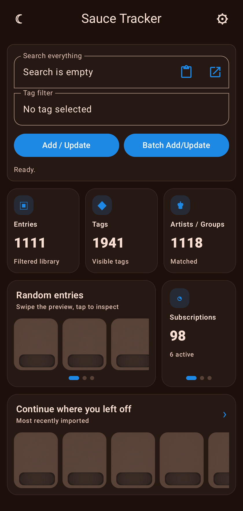
</p>

Sauce Tracker combines a searchable library, an integrated browser, reading history, recommendations, subscriptions, downloads, backups, and interactive tag and entry heatmaps in one on-device app.

> [!IMPORTANT]
> Sauce Tracker can display links and metadata for adult material. It is intended only for adults where such content is legal. The project is independent and is not affiliated with or endorsed by the website it accesses.

## Feature highlights

<table>
  <tr>
    <td width="36%">
      <h3>Your library, your way</h3>
      Search across codes, titles, metadata, dates, pages, tags, artists, and groups. Filter, sort, rate, pin, track read status, and move directly between related parts, even when the destination is hidden by the current filter.
    </td>
    <td align="center">
      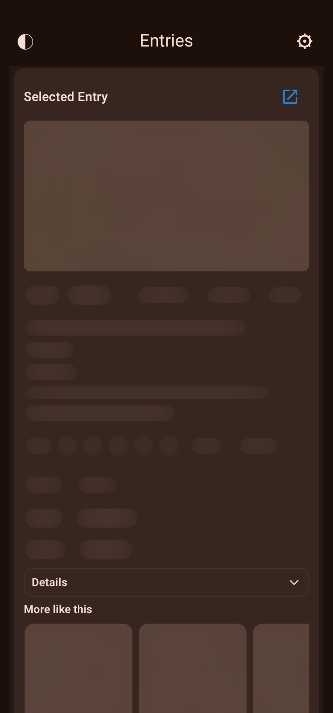
      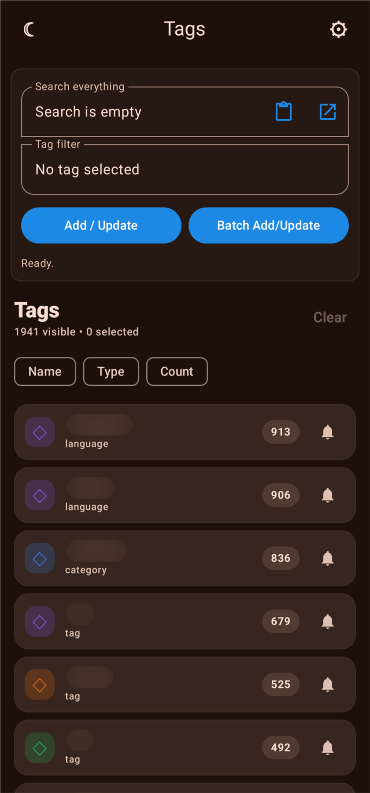
    </td>
  </tr>
  <tr>
    <td width="36%">
      <h3>Browse and import in context</h3>
      Open a library entry in the integrated browser, detect duplicates, update metadata, and return without losing the active browser task or the visible library state.
    </td>
    <td align="center">
      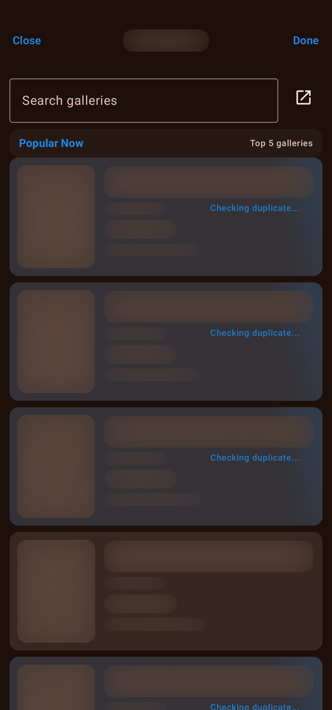
      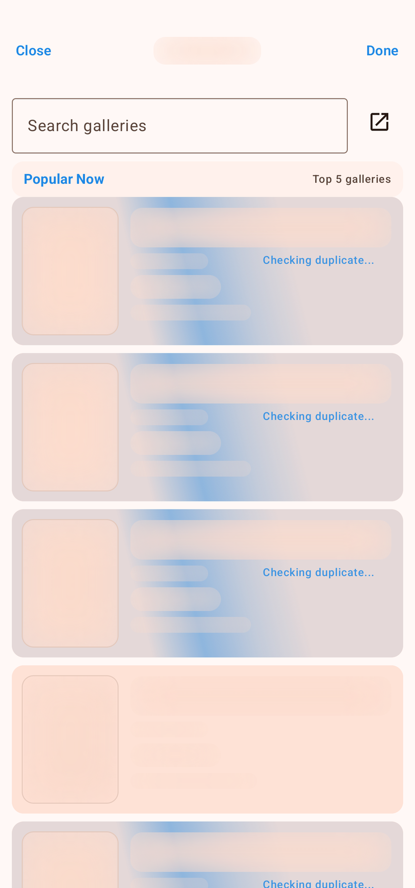
    </td>
  </tr>
  <tr>
    <td width="36%">
      <h3>Revisit and discover</h3>
      Reading history, suggestions, subscriptions, artist pages, related entries, and heatmaps make a large library navigable without sending the collection to a cloud service.
    </td>
    <td align="center">
      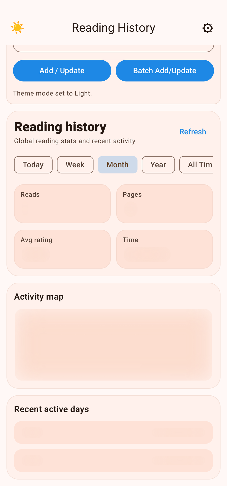
      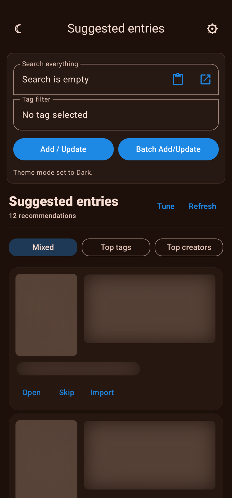
    </td>
  </tr>
  <tr>
    <td width="36%">
      <h3>Read in either direction</h3>
      Downloaded galleries can be read in horizontal or vertical slideshow modes, with separate privacy behavior for the library, browser, and reader surfaces.
    </td>
    <td align="center">
      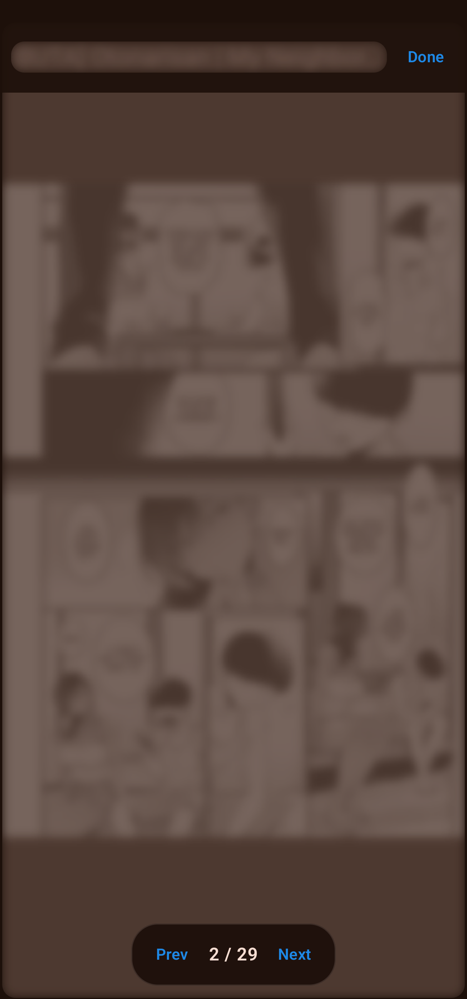
      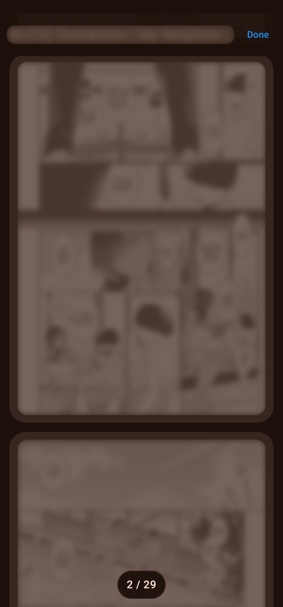
    </td>
  </tr>
</table>

<details>
  <summary><strong>View all screenshots</strong></summary>
  <br>
  <table>
    <tr>
      <th>Dashboard, dark</th>
      <th>Dashboard, light</th>
      <th>Dashboard, incognito</th>
    </tr>
    <tr>
      <td></td>
      <td>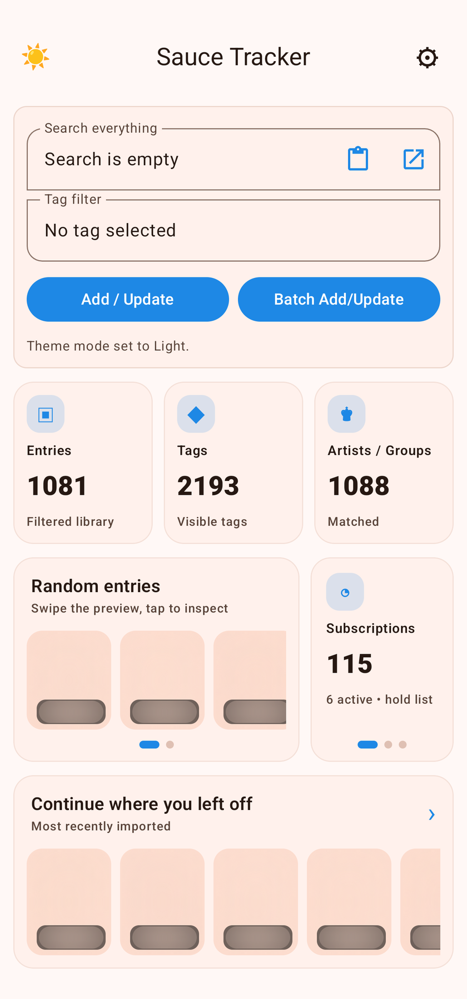</td>
      <td>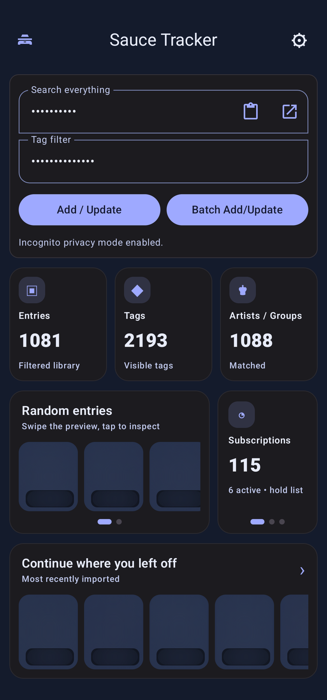</td>
    </tr>
    <tr>
      <th>Selected entry</th>
      <th>Tags</th>
      <th>Suggested entries</th>
    </tr>
    <tr>
      <td></td>
      <td></td>
      <td></td>
    </tr>
    <tr>
      <th>Browser, dark</th>
      <th>Browser, light</th>
      <th>Reading history</th>
    </tr>
    <tr>
      <td></td>
      <td></td>
      <td></td>
    </tr>
    <tr>
      <th>Duplicate check</th>
      <th>Entry customization</th>
      <th>Display</th>
    </tr>
    <tr>
      <td>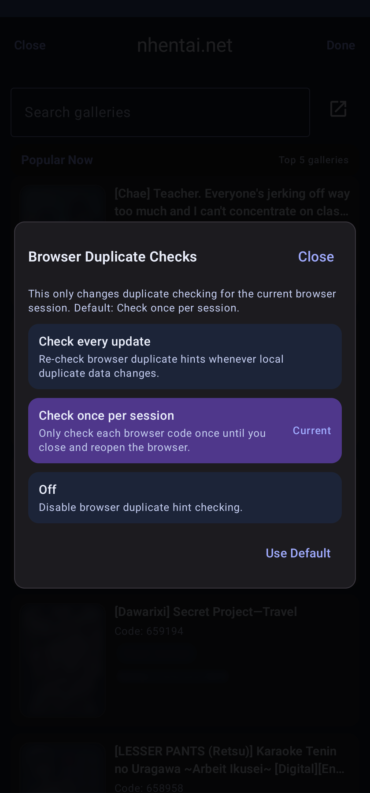</td>
      <td>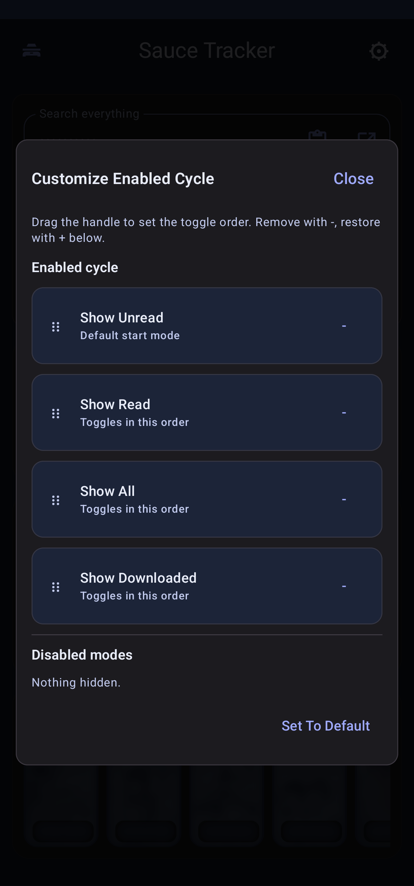</td>
      <td>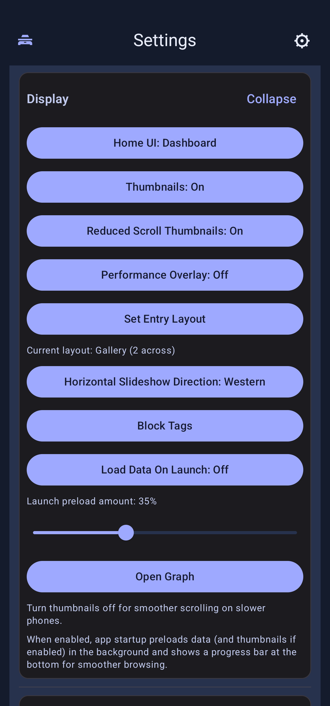</td>
    </tr>
    <tr>
      <th>Personalization</th>
      <th>Data</th>
      <th>Stats and security</th>
    </tr>
    <tr>
      <td>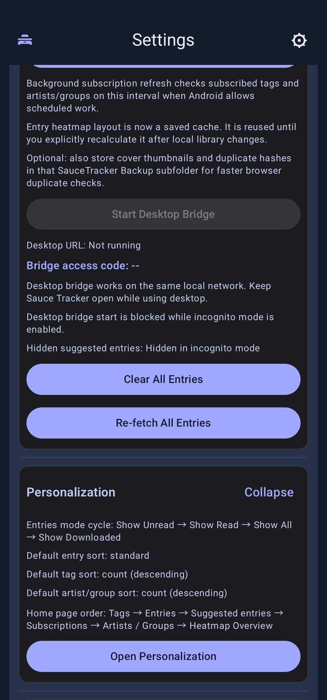</td>
      <td>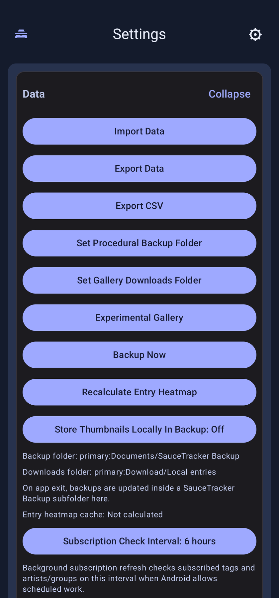</td>
      <td>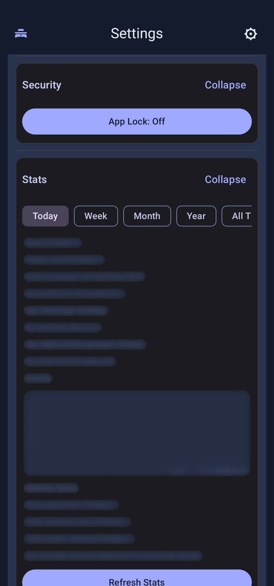</td>
    </tr>
    <tr>
      <th>Horizontal slideshow</th>
      <th>Vertical slideshow</th>
      <th>Direction picker</th>
    </tr>
    <tr>
      <td></td>
      <td></td>
      <td>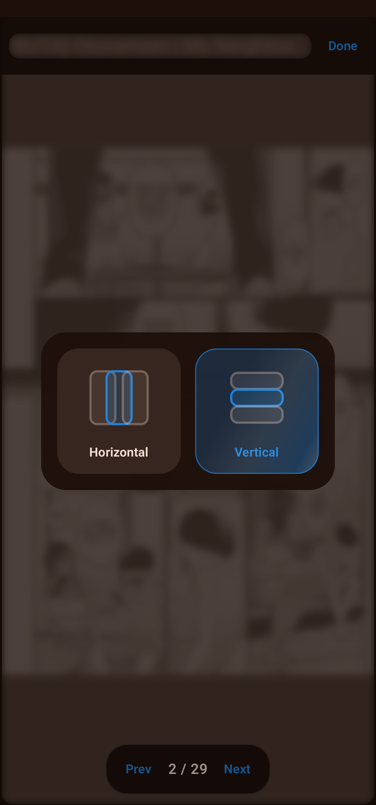</td>
    </tr>
  </table>
</details>

> Screenshots were captured with Sauce Tracker's privacy masking enabled; private search terms, metadata, and thumbnails are obscured.

## What is new in 1.8

Version 1.8 turns the 1.7 architecture into practical speed, discovery, and reliability improvements for large libraries.

- Added Sauce Finder: choose or share an image and search a local perceptual-hash index for its matching entry and page.
- Made Sauce Finder incremental, pausable, bounded, and four-way parallel; existing hashes are reused and the real index size is shown in the UI.
- Added Sauce Finder as the third discovery page beside Suggested and Random entries.
- Rebuilt Suggested Entries around cached profiles, metadata, candidates, and results so repeat opens are substantially faster.
- Restored cached Suggested Entry thumbnails after app restarts and made dashboard previews jump to the tapped recommendation.
- Redesigned Suggested Entries cards, loading state, controls, swipe surfaces, and privacy masking to match the modern dashboard.
- Added website-provided More like this recommendations to Browser detail pages, with real titles and direct navigation.
- Fixed Browser comments repeating the author name instead of displaying the message, plus duplicate tag-count labels on affected tags.
- Tightened Parts, More like this, and Same artist filtering: Parts remain filter-independent while other local recommendations respect Read/Unread context.
- Refined Tag and Entry Heatmap presentation into the page layout while preserving nodes, layout behavior, pan, zoom, and thumbnail-zone controls.
- Centralized library-change propagation so imports, deletes, ratings, reads, tags, subscriptions, heatmaps, and suggestions update coherently.
- Kept thumbnail previews warm across updates and cold starts, and made tag counts reflect the active library filter atomically.
- Made Today, Week, Month, Year, activity heatmaps, and reading-session day grouping follow the phone's local timezone while preserving UTC timestamps internally.
- Hid already imported galleries from subscription updates and notification counts without removing them from complete backup history.
- Added working dashboard page ordering in Personalization for Random, Suggested, and Sauce Finder, plus Subscriptions, Heatmap, and History.
- Put entry-cycle, adaptive Home/Dashboard order, Browser, and default-sort controls directly inside the Personalization card, removing the duplicate order setting and intermediate overlay.
- Further split the large Dashboard and Browser hosts into focused feature, parsing, media, duplicate, backup, download, and UI components.
- Added a privacy-safe GitHub Media Mode with separate data, strong thumbnail masking, theme control, and capture tooling.
- Added optional, direction-aware volume-button page navigation in Gallery Slideshow; vertical steps center middle pages while anchoring the first and last pages to their respective edges.
- Prevented Android back gestures and outside taps from accidentally dismissing the Browser exit rating prompt; Skip remains the explicit way to continue without rating.
- Moved the production Android identity to `com.roinur.saucetracker`, with full library and settings migration through export/import.

See [CHANGELOG.md](CHANGELOG.md) for the complete release summary.

## Features

### Library

- Search across codes, titles, metadata, dates, pages, tags, artists, groups, and other structured fields.
- Filter by tags and Read, Unread, Downloaded, or All entries.
- Sort, rate, pin, mark as read, inspect reading sessions, and browse related entries.
- Standard card layout and configurable pure gallery layout.
- Artist/group pages, history, suggestions, subscriptions, and recent activity.

### Browser and reader

- Open imported entries or searches in the integrated browser.
- Import and update library metadata without leaving the app.
- Duplicate hints, blocked-tag handling, and separate Browser privacy behavior.
- Local downloads, experimental gallery support, and horizontal or vertical slideshow reading.

### Discovery and visualization

- Personalized suggestions with adjustable weighting, cached repeat loads, persistent previews, and safe fallback behavior.
- Tag Heatmap and precalculated Entry Heatmap with pan, zoom, selection, and bounded thumbnail loading.
- Parts, More like this, and Same artist navigation from Selected Entry.
- Local Sauce Finder using a private incremental perceptual-hash index.

### Privacy, backup, and background work

- App lock and separate Library/Browser incognito policies.
- Manual import/export and procedural rolling backups.
- Optional shared backup thumbnail archive.
- Subscription background refresh with actionable notifications.
- Optional local Desktop Bridge.

## Download and install

Download `Sauce-Tracker-1.8-release.apk` and its checksum from the [latest GitHub Release](../../releases/latest).

Android 8.0 (API 26) or newer is required.

Version 1.8 uses the new `com.roinur.saucetracker` Android identity. Android therefore installs it beside builds using the former package rather than updating them in place. Create a fresh export in the former app, import it into the new app, reselect Android document folders, and verify the result before uninstalling the former app.

To install with ADB:

```powershell
adb install -r Sauce-Tracker-1.8-release.apk
```

Android may require permission to install apps from the file manager or browser used to open the APK. Back up important library data before replacing an older or differently signed build.

## Build from source

Requirements:

- JDK 21 to run Gradle.
- Android SDK Platform 34 and matching build tools.
- An ARM64 Android device or emulator for the current release target.

```powershell
git clone https://github.com/Roinur/Sauce-tracker.git
cd Sauce-tracker
./gradlew :app:testDebugUnitTest :app:assembleDebug
```

On Windows:

```powershell
.\gradlew.bat :app:testDebugUnitTest :app:assembleDebug
```

Release builds read signing values from an ignored `signing.properties` file, Gradle properties, or environment variables. Copy `signing.properties.example` locally and never commit credentials or keystores.

```powershell
.\gradlew.bat :app:assembleRelease
```

The app compiles Kotlin/Java bytecode for Java 17 while Gradle itself is run with JDK 21.

### Private screenshot workflow

The ADB-only [GitHub media mode](docs/GITHUB_MEDIA.md) opens the real app UI against a separate database copy. It can apply the existing privacy mask while preserving either the normal light or dark color scheme. The production library and rolling backups are not modified.

## Project structure

```text
app/             application entry points, navigation, and lifecycle
background/      scheduled subscription work
core/            network, media, preferences, privacy, storage, and diagnostics
data/            database, DAO, repositories, backup, downloads, and remote parsing
feature/         browser, dashboard, library, heatmap, slideshow, settings, and discovery
```

The package root is `com.roinur.saucetracker`. The modular layout keeps feature-specific state and expensive work scoped to the screen that owns it.

## Data and network behavior

- Library data, settings, heatmap caches, and reading history are stored locally.
- Network access is used when opening the integrated browser, fetching gallery metadata, refreshing subscriptions, or downloading media.
- Website availability and response formats are outside the project's control; Sauce Tracker distinguishes temporary website failures from device-network problems and permanent HTTP responses.

## Release integrity

Official releases should include:

- `Sauce-Tracker-1.8-release.apk`
- `Sauce-Tracker-1.8-release.apk.sha256`
- release notes matching [CHANGELOG.md](CHANGELOG.md)

Verify the checksum before sideloading when the APK was downloaded through a third party.

## Contributing

Issues should include the app version, Android version, exact screen and action, expected result, and whether the app crashed or only displayed an error. Avoid attaching personal library exports, unblurred thumbnails, signing files, or credentials.

## License

No public source-code license has been selected. Until a license is added, copyright remains with the project owner and the source is not granted for redistribution.
